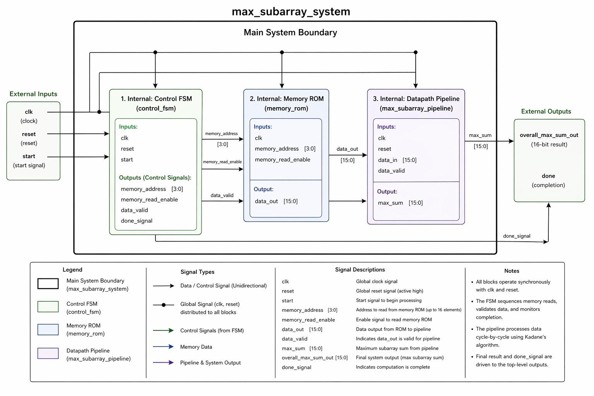
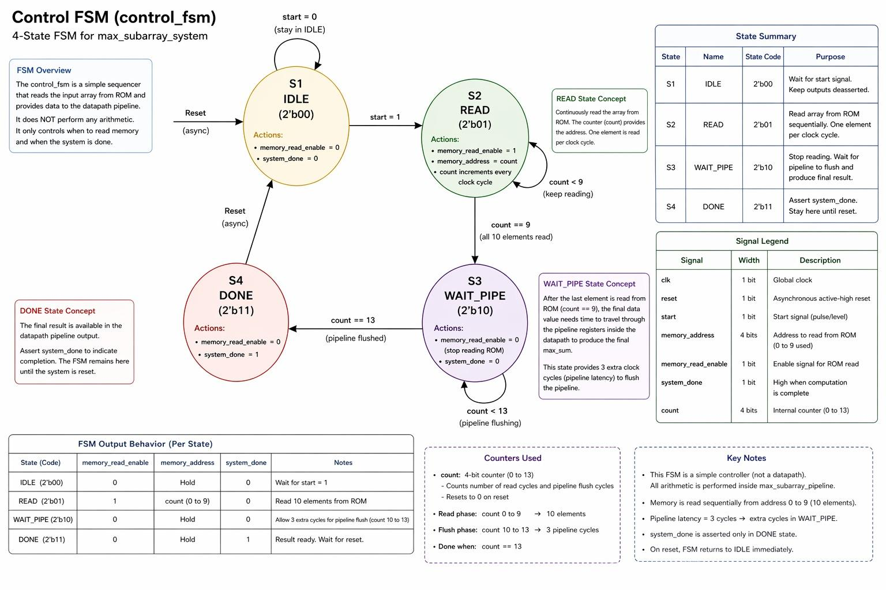
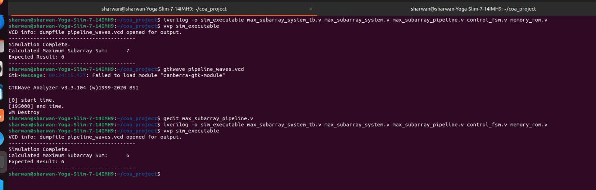
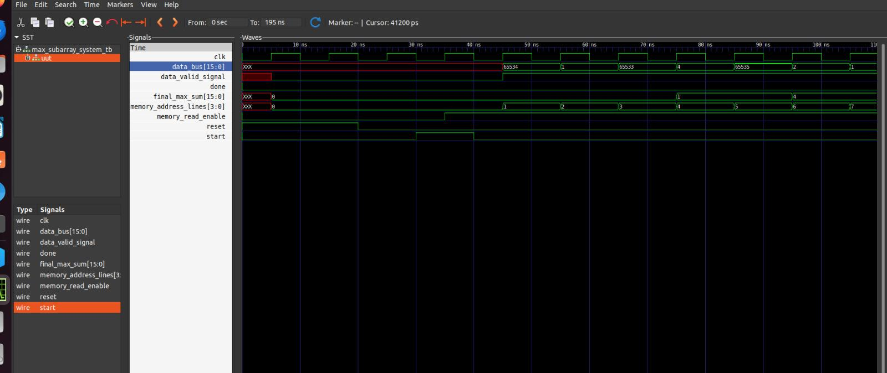

# Kadane's Algorithm in Hardware — Pipelined Verilog Implementation

A hardware (RTL) implementation of the Maximum Subarray Sum problem (Kadane's Algorithm), built in Verilog HDL as a synchronous, pipelined digital circuit — not a software simulation of the algorithm, an actual synthesizable hardware architecture for it.

The point of the project: Kadane's Algorithm is normally a 5-line `for` loop. This translates that same logic into RTL — a Control FSM, a memory unit, and a pipelined datapath — the way it would actually need to look to run on an FPGA or ASIC.

Full write-up: [report/Kadane_Verilog_Report.pdf](report/Kadane_Verilog_Report.pdf)

## Architecture

The system is split into three decoupled modules wired together by a structural top module, following standard ASIC/FPGA design practice of separating control from datapath:

- **`control_fsm.v`** — a 4-state Moore FSM (`IDLE → READ → WAIT_PIPE → DONE`) that sequences memory reads and tracks pipeline flush cycles. It does no arithmetic — purely a sequencer.
- **`memory_rom.v`** — synchronous ROM preloaded with the signed test vector `[-2, 1, -3, 4, -1, 2, 1, -5, 4]`, outputs one 16-bit signed integer per clock cycle.
- **`max_subarray_pipeline.v`** — the datapath. Computes Kadane's recurrence every cycle:
  - `current_sum = max(current_element, current_sum + current_element)`
  - `max_sum = max(max_sum, current_sum)`
- **`max_subarray_system.v`** — top-level module wiring FSM, ROM, and pipeline together, distributing `clk`/`reset` globally.
- **`max_subarray_system_tb.v`** — testbench: generates a 10ns clock, drives reset/start, waits for `done`, and prints the result.



### FSM design

| State | Code | Purpose |
|---|---|---|
| IDLE | `2'b00` | Wait for `start`, outputs deasserted |
| READ | `2'b01` | Stream 10 elements from ROM, one per cycle |
| WAIT_PIPE | `2'b10` | Hold 3 extra cycles to flush pipeline latency |
| DONE | `2'b11` | Assert `system_done`, hold until reset |



## The interesting part: a real hazard, found and fixed

This wasn't just "write Verilog that matches the math" — a genuine Read-After-Write (RAW) hazard showed up during simulation:

The pipeline's `current_sum` register has a one-cycle write delay. When the test array transitioned from a large positive running sum to a negative element, the datapath read a **stale** value of `current_sum` on the next cycle, corrupting the result. First simulation run gave **7** instead of the correct **6**.

**Fix:** added a combinational feedback wire (`next_current_sum`) that computes the local running sum *asynchronously within the same cycle*, bypassing the register delay entirely — while keeping the global max comparison registered (for timing stability). Hybrid: combinational where staleness would break correctness, registered where speed matters.

```verilog
wire signed [15:0] next_current_sum;
assign next_current_sum = (current_sum < 0) ? data_in : (current_sum + data_in);
```

Re-running the simulation after the fix gave the correct result:



## Verification

- **Toolchain:** RTL written in VS Code, compiled/simulated with [Icarus Verilog](http://iverilog.icarus.com/), waveforms inspected in [GTKWave](http://gtkwave.sourceforge.net/).
- **Test input:** `[-2, 1, -3, 4, -1, 2, 1, -5, 4]` → expected max subarray `[4, -1, 2, 1]`, sum = **6**.
- Waveform trace confirms cycle-accurate behavior: `memory_address` increments exactly once per cycle, `data_bus` propagates every ROM value without drops, and `done` stays low until the WAIT_PIPE flush completes.



## Building & running

Requires [Icarus Verilog](http://iverilog.icarus.com/) and [GTKWave](http://gtkwave.sourceforge.net/).

```bash
iverilog -o sim_executable max_subarray_system_tb.v max_subarray_system.v max_subarray_pipeline.v control_fsm.v memory_rom.v
vvp sim_executable
gtkwave pipeline_waves.vcd
```

Expected terminal output:
```
Simulation Complete.
Calculated Maximum Subarray Sum:   6
Expected Result: 6
```

## Project structure

```
.
├── control_fsm.v              # Control FSM: 4-state sequencer
├── memory_rom.v                # Synchronous ROM with test vector
├── max_subarray_pipeline.v     # Pipelined datapath (Kadane's core logic + hazard fix)
├── max_subarray_system.v       # Top-level structural module
├── max_subarray_system_tb.v    # Testbench
└── screenshots/                # Architecture diagrams, terminal output, waveforms
```

## Why hardware, not just software

Kadane's Algorithm is O(n) in software with trivial implementation. The point of doing it in Verilog is architectural: after the initial pipeline latency, this circuit processes **one array element per clock cycle**, and the exercise forces you to confront problems that don't exist in software at all — pipeline hazards, signal timing, register delay, and pipeline flush latency — the actual difference between sequential execution and clocked parallel hardware.

## Team

- Manieesh — CS24B1005
- Sharwan — CS24B1059
- Jeevan Pranav — CS24B1056

Computer Organization and Architecture course project.
